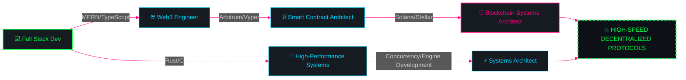

<div align="center">
  
</div>

<br>

<!-- <div align="center">
  
</div> -->

<div align="center">
  
  
  
  
</div>

<br>

<!--  -->

## [CLASSIFIED] OPERATIVE PROFILE

<div align="center">
<table border="0" width="100%">
<tr>
<td width="55%" valign="top">

```yaml
╔═══════════════════════════════════════════╗
║  OPERATIVE ID: Srizdebnath                ║
║  NAME: Sriz Debnath                       ║
║  BASE: Kolkata, West Bengal               ║
║  HQ: GCELT                                ║
║  DIVISION: R&D (Blockchain & Systems)     ║
║  CLEARANCE: Level 5 (Root)                ║
║  STATUS: Broadcasting...                  ║
╚═══════════════════════════════════════════╝

🎓 ACADEMY RECORD:
   └─ B.Tech (CSE) @ GCELT
   └─ Government College (West Bengal)
   └─ Specialization: Decentralized Systems
   
🎯 MISSION DIRECTIVE:
   └─ Architect Scalable Smart Contracts
   └─ Build High-Performance Systems
   └─ Arbitrum & Solana Ecosystem Expansion
   
⚡ ACTIVE PROTOCOLS:
   └─ Vyper / Arbitrum Web3 IDE
   └─ Rust-Based Chess Engine (Concurrency)
   └─ Backend Engineering (MERN / Rust / Go)
```

</td>
<td width="45%" valign="top">

<br>

### `💻 SOURCE CODE IDENTITY`

```python
class SrizDebnath:
    def __init__(self):
        self.role = "Blockchain & Systems Engineer"
        self.passion = ["Web3", "Systems", "Open Source"]
        self.os = "Arch Linux"
        self.hq = "Synapse"
    
    def execute_mission(self):
        while True:
            self.code()
            self.coffee()
            self.deploy("Arbitrum Mainnet")

# Initializing...
agent = SrizDebnath()
agent.execute_mission()
```

</td>
</tr>
</table>
</div>

<!--  -->

## [INTEL] DEPLOYMENT METRICS & ACHIEVEMENTS

<div align="center">
  <h3>OPERATIVE MILESTONES</h3>
  
</div>

<br>

<div align="center">
  <h3>LANGUAGE DISTRIBUTION (BY REPOSITORIES)</h3>
  
  
  
  
  
  
</div>

<br>

<div align="center">
  <table border="0" cellpadding="0" cellspacing="0" width="100%">
    <tr>
      <td width="50%" align="center" valign="top">
        
      </td>
      <td width="50%" align="center" valign="top">
        
      </td>
    </tr>
  </table>
</div>

<br>

<div align="center">
  
</div>

<br>


## [ARCHIVES] MAIN OPS & ACTIVE SHOWCASE

<div align="center">
  <p><i>Live telemetry and source code archives for primary systems, blockchain compilers, and decentralized platforms.</i></p>
</div>

<div align="center">

| 🐍 [PyBitrum](https://github.com/Srizdebnath/PyBitrum) | 🦀 [Prometheus](https://github.com/Srizdebnath/Prometheus) |
| :--- | :--- |
| **State-of-the-art Web3 IDE for the Arbitrum ecosystem.** Enables writing smart contracts using Pythonic syntax, which is automatically compiled into Vyper and deployed with a single click. <br><br>    | **Next-generation Rust chess engine competing at the highest level.** An ambitious, highly-optimized engine designed to leverage Rust's safety and concurrent execution models. <br><br>    |

| 🌌 [stellar-nexus](https://github.com/Srizdebnath/stellar-nexus) | 🌐 [voria](https://github.com/Srizdebnath/voria) |
| :--- | :--- |
| **Advanced decentralized hub connecting distributed ledgers.** Engineered for scale, speed, and real-time operations on the Stellar network ecosystem. <br><br>    | **A premium web presence and custom framework ecosystem.** Engineered for ultra low-latency distribution and modern decentralized applications. <br><br>    |

</div>


## [ARSENAL] SYSTEM CONFIGURATION

<div align="center">
  <p><i>A curated collection of systems languages, technical tools, decentralized networks, and infrastructures.</i></p>
</div>

<div align="center">

### Core Programming Languages


### Blockchain & Web3 Ecosystems


### Full-Stack Development


### DevOps & Infrastructure


</div>


## [ROADMAP] ADVANCEMENT PATH

<div align="center">


```mermaid
%%{init: {'theme':'dark', 'themeVariables': { 'darkMode':'true', 'primaryColor':'#00ff41', 'primaryTextColor':'#fff', 'primaryBorderColor':'#00ff41', 'lineColor':'#ff0080', 'secondaryColor':'#00d4ff', 'tertiaryColor':'#0d1117'}}}%%
graph LR
    A[💻 Full Stack Dev] -->|MERN/TypeScript| B[🌐 Web3 Engineer]
    B -->|Arbitrum/Vyper| C[⛓️ Smart Contract Architect]
    C -->|Solana/Stellar| D[🚀 Blockchain Systems Architect]
    A -->|Rust/C| E[🦀 High-Performance Systems]
    E -->|Concurrency/Engine Development| F[⚡ Systems Architect]
    D & F --> G[💥 HIGH-SPEED DECENTRALIZED PROTOCOLS]
    
    style A fill:#161b22,stroke:#00ff41,color:#00ff41,stroke-width:2px
    style B fill:#161b22,stroke:#00d4ff,color:#00d4ff,stroke-width:1px
    style C fill:#161b22,stroke:#00d4ff,color:#00d4ff,stroke-width:1px
    style D fill:#161b22,stroke:#ff0080,color:#ff0080,stroke-width:2px
    style E fill:#161b22,stroke:#00d4ff,color:#00d4ff,stroke-width:1px
    style F fill:#161b22,stroke:#00d4ff,color:#00d4ff,stroke-width:1px
    style G fill:#0d1117,stroke:#00ff41,color:#00ff41,stroke-width:3px,stroke-dasharray: 5 5
```

</div>


## [OMNI-LINK] ESTABLISH UPLINK

<div align="center">

<table border="0" cellpadding="10" cellspacing="0">
<tr>
<td align="center" valign="top">
  <a href="https://www.linkedin.com/in/srizdebnath">
    
  </a>
  <br><strong>encrypted_channel_01</strong>
</td>
<td align="center" valign="top">
  <a href="https://x.com/Srizdebnath">
    
  </a>
  <br><strong>public_feed</strong>
</td>
<td align="center" valign="top">
  <a href="https://sriz.netlify.app/">
    
  </a>
  <br><strong>base_of_operations</strong>
</td>
</tr>
</table>

<br>

###  DIRECT MESSAGE PROTOCOL

<a href="mailto:srizd449@gmail.com">
  
</a>

</div>

<br>

<div align="center">

```ascii
  ╔═══════════════════════════════════════════════════════════╗
  ║                                                           ║
  ║   > Connection terminated by user request                 ║
  ║   > Logs encrypted and archived                           ║
  ║   > "Keep building, keep decentralizing."                 ║
  ║   > Session closed ✓                                      ║
  ║                                                           ║
  ╚═══════════════════════════════════════════════════════════╝
```


</div>
