<div align="center">
  
</div>

<br>

<div align="center">
  
</div>

<div align="center">
  
  
  
  
</div>

<br>

<p align="center">
  
  
</p>


## 📂 `[CLASSIFIED] OPERATIVE PROFILE`

<div align="center">
<table>
<tr>
<td width="55%" valign="top">

```yaml
╔═══════════════════════════════════════════╗
║  OPERATIVE ID: Srizdebnath                ║
║  NAME: Sriz Debnath                       ║
║  BASE: Kolkata, West Bengal               ║
║  HQ: GCELT                                ║
║  DIVISION: R&D (Blockchain & AI)          ║
║  CLEARANCE: Level 5 (Root)                ║
║  STATUS: Broadcasting...                  ║
╚═══════════════════════════════════════════╝

🎓 ACADEMY RECORD:
   └─ B.Tech (CSE)
   └─ Government College (GCELT)
   └─ Specialization: Decentralized Systems
   
🎯 MISSION DIRECTIVE:
   └─ Architect Scalable Smart Contracts
   └─ Train Autonomous AI Agents
   └─ Solana Ecosystem Expansion
   
⚡ ACTIVE PROTOCOLS:
   └─ Hack4Bengal (Veteran)
   └─ School of Solana (Initiate)
   └─ Backend Engineering (MERN)
```

</td>
<td width="45%" valign="top">

<br>

### `💻 SOURCE CODE IDENTITY`

```python
class SrizDebnath:
    def __init__(self):
        self.role = "Blockchain Developer"
        self.passion = ["Web3", "AI", "Open Source"]
        self.os = "Arch Linux"
    
    def execute_mission(self):
        while True:
            self.code()
            self.coffee()
            self.deploy("Mainnet")

# Initializing...
agent = SrizDebnath()
agent.execute_mission()
```

</td>
</tr>
</table>
</div>


## ⚔️ `[ARSENAL] TECH STACK`

<div align="center">
  <p><i>A robust arsenal of tools for building autonomous agents, scalable infrastructure, and cutting-edge decentralized applications.</i></p>
</div>

<div align="center">

### `🚀 DEVOPS & AUTOMATION`


### `🤖 AI / ML & AGENTS`


### `🔗 BLOCKCHAIN & WEB3`


### `💻 FULL STACK (MERN)`


</div>


## 📊 `[INTEL] GITHUB OPERATIONS`

<div align="center">


<br>

</div>


## 🗺️ `[ROADMAP] UPGRADE PATH`

```mermaid
%%{init: {'theme':'dark', 'themeVariables': { 'darkMode':'true', 'primaryColor':'#00ff41', 'primaryTextColor':'#fff', 'primaryBorderColor':'#00ff41', 'lineColor':'#ff0080', 'secondaryColor':'#00d4ff', 'tertiaryColor':'#0d1117'}}}%%
graph LR
    A[💻 Full Stack Dev] -->|MERN| B[🌐 Web3 Initiate]
    B -->|Solidity/EVM| C[⛓️ Smart Contract Engineer]
    C -->|Rust/Solana| D[🚀 Blockchain Architect]
    A -->|Python/Data| E[🤖 AI Enthusiast]
    E -->|TensorFlow/LLM| F[🧠 ML Practitioner]
    D & F --> G[🔥 THE SINGULARITY: AI + WEB3]
    
    style A fill:#00ff41,stroke:#00ff41,color:#000
    style B fill:#00d4ff,stroke:#00d4ff,color:#000
    style C fill:#00d4ff,stroke:#00d4ff,color:#000
    style D fill:#ff0080,stroke:#ff0080,color:#fff
    style E fill:#00d4ff,stroke:#00d4ff,color:#000
    style F fill:#00d4ff,stroke:#00d4ff,color:#000
    style G fill:#0d1117,stroke:#ff0080,color:#ff0080,stroke-width:2px,stroke-dasharray: 5 5
```

<div align="center">



</div>


## 📡 `[OMNI-LINK] ESTABLISH UPLINK`

<div align="center">

<table>
<tr>
<td align="center">

[](https://www.linkedin.com/in/srizdebnath)
<br>
**encrypted_channel_01**

</td>
<td align="center">

[](https://x.com/Srizdebnath)
<br>
**public_feed**

</td>
<td align="center">

[](https://sriz.netlify.app/)
<br>
**base_of_operations**

</td>
</tr>
</table>

### `📨 DIRECT MESSAGE PROTOCOL`

[](mailto:srizd449@gmail.com)

</div>

<br>

<div align="center">

```ascii
  ╔═══════════════════════════════════════════════════════════╗
  ║                                                           ║
  ║   > Connection terminated by user request                 ║
  ║   > Logs encrypted and archived                           ║
  ║   > "Keep building, keep decentralizing."                 ║
  ║   > Session closed ✓                                      ║
  ║                                                           ║
  ╚═══════════════════════════════════════════════════════════╝
```


</div>
